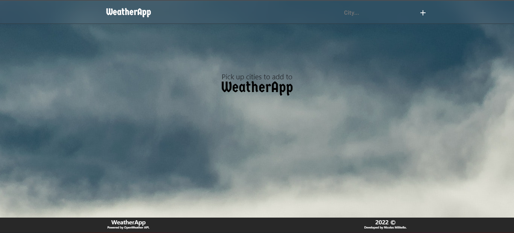
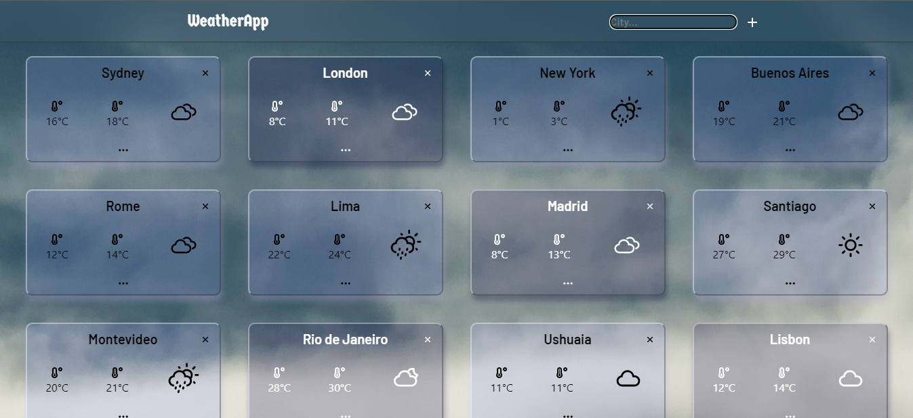
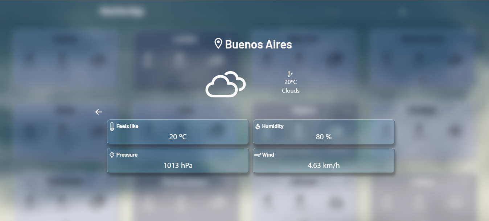

# WeatherApp

This is a responsive React App done during the Henry's bootcamp.

Through this app it is possible to check the weather in different cities around the world.
It consumes data from the OpenWeather API.

For the development, JavaScript, React and Styled Components were used.

---

Esta es una responsive React App hecha durante el bootcamp de Henry.

A través de esta app se puede consultar el clima de diferentes ciudades alrededor del mundo. Consume datos de OpenWeather API.

Se utlizó JavaScript, React y Styled-Components para el desarrollo.

---

---

Link: https://weatherapp-nicolas-militello.vercel.app/
